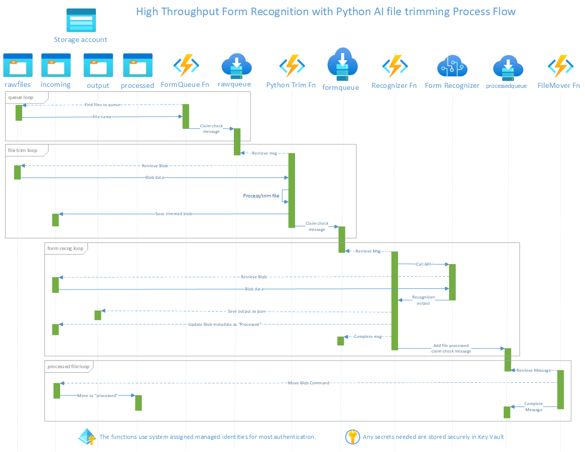

# High Throughput Form Recognizer

This repository is offered to demonstrate a set of resources that will allow you to leverage [Azure AI Document Intelligence](https://learn.microsoft.com/en-us/azure/ai-services/document-intelligence/?view=doc-intel-4.0.0) for high throughput of processing documents stored in Azure Blob Storage. 

If you have multi-page forms that you want to pre-process and trim the number of pages prior to running them through the [Azure AI Document Intelligence](https://learn.microsoft.com/en-us/azure/ai-services/document-intelligence/?view=doc-intel-4.0.0), you can use this project on conjunction with a Python Function that will perform [Teseract OCR](https://pypi.org/project/pytesseract/) to select only specific pages based in identifying keywords. This function can be found at the [PythonAIFunction repository](https://github.com/mmckechney/PythonAIFunction).

**IMPORTANT!** In addition to leveraging the solution below, it will also be beneficial to _request a transaction limit increase_ for your Form Recognizer Accounts. Instructions for how to do this can be found in the [Azure AI Document Intelligence Documentation](https://docs.microsoft.com/en-us/azure/applied-ai-services/form-recognizer/service-limits#increasing-transactions-per-second-request-limit)

## Features

This solution leverages the following Azure services:

- **Azure Blob Storage** with three or four containers
  - `rawforms` - Location for the multi-page forms that you want to trim pages from (used only in conjunction with the [PythonAIFunction function](https://github.com/mmckechney/PythonAIFunction))
  - `incoming`  - stores the forms/files that you want to process
  - `output` - the location where the Form Recognition JSON output is stored. The file names match the original files, with the extension changed to `.json`
  - `processed` - where the forms/files are moved to once successfully processed by Form Recognizer
- **Azure Service Bus** with two or three queues
  - `rawqueue` - Message containing message for the multi-page forms that you want to trim (used only in conjunction with the [PythonAIFunction function](https://github.com/mmckechney/PythonAIFunction))
  - `formqueue` - this contains the messages for the files that need to be processed
  - `processedqueue` - this contains the messages for files that have been processed and need to be moved to the `processed` blob container
- **Form Recognizer** - the Azure Cognitive Services API that will perform the form recognition and processing.
- Three **Azure Functions**
  - `FormQueue` - identifies the files in the `incoming` blob container and send a claim check message (containing the file name) to the `formqueue` queue. If used in conjunction with the [PythonAIFunction](https://github.com/mmckechney/PythonAIFunction) by using the `useRawFiles=true` query string, it will instead identify files int he `rawfiles` container and send a claim check message to the `rawqueue` queue.
  - `Recognition` - processes the message in `formqueue` to Form Recognizer, then update Blob metadata as "processed" and create new message in `processedqueue` queue \
    This function employs scale limiting and [Polly](https://github.com/App-vNext/Polly) retries with back off for Form Recognizer 429 (too many requests) replies to balance maximum throughput and overloading the API endpoint
  - `FileMover` - processes messages in the `processedqueue` to move files from `incomming` to `processed` blob containers
- Additional Azure function for multi-page pre-processing as integrated from the [PythonAIFunction repository](https://github.com/mmckechney/PythonAIFunction) if needed


### Multiple Form Recognizer endpoints

To further allow for high throughput, the `Recognition` function can distribute form recognition between 1-10 separate Form Recognizer accounts. This is managed by the `FormQueue` funtion automatically adding a `RegognizerIndex` value of 0-9 when queueing the files for processing. 

The recognizer will distribute the files to the appropriate account (regardless of the number of Form Recognizer accounts actually provisioned). 

To configure multiple Form Recognizer accounts with the script below, add a value between 1-10 for the `-formRecognizerInstanceCount` (default is 1). To configure manually, you will need to add all of the Form Recognizer account keys to the Azure Key Vault's `FORM-RECOGNIZER-KEY` secret -- _space separated_

_Assumption:_ all instances of the Form Recognizer share the same URL (such as: https://eastus.api.cognitive.microsoft.com/)

## Process Flow
This shows the flow including the Python pre-processing, Tesseract OCR function. If you do not need this pre-processing, you can leverage the FormQueue function to queue message directly from the `incomming` blob container. 



## Get Started

To try out the sample end-to-end process, you will need:

- An Azure subscription that you have privileges to create resources. 
- Your public IP address. You can easily find it by following [this link](https://www.bing.com/search?q=what+is+my+ip).
- Have the [Azure CLI installed](https://docs.microsoft.com/en-us/cli/azure/install-azure-cli).

### Running deployment script

1. Login to the Azure CLI:  `az login`
2. Run the deployment command

    ``` PowerShell
    .\deploy.ps1 -appName <less than 6 characters> -location <azure region> -myPublicIp <your public ip address>

    ```

3. If you are also going to leverage the Python AI pre-processing, you will also need to run the [`deploy.ps1`](https://github.com/mmckechney/PythonAIFunction/blob/main/deploy.ps1) script from that solution with matching `-appName`, `-location`, and `-myPublicIp` parameters. 

These scripts will create all of the Azure resources needed for the demonstration.

### Running a demonstration

To exercise the code and run the demo, follow these steps:

#### With Teseract OCR pre-processing from [PythonAIFunction repository](https://github.com/mmckechney/PythonAIFunction)

1. Upload the samle form files to the storage account's `rawfiles` container. To help with this, you can try the supplied PowerShell script [`BulkUploadAndDuplicate.ps1`](Scripts/BulkUploadAndDuplicate.ps1). This script will take a directory of local files and upload them to the storage container. Then, based on your settings, duplicate them to help you easily create a large library of files to process

    ```Powershell
        .\BulkUploadAndDuplicate.ps1 -path "<path to dir with sample file>" -storageAccountName "<storage account name>" -containerName "rawfiles" -counterStart 0 -duplicateCount 10
    ```

    The sample script above would would upload all of the files found in the `-path` directory, then create copies of them prefixed with 000000 through 000010. You can of course upload the files any way you see fit.

2. In the Azure portal, navigate to the resource group that was created and locate the function with "Queue" in the name. Then select the Functions list and select the function method `FormQueue`. In the "Code + Test" link. In the query parameters add `useRawFiles=true` then select Test/Run and hit "Run". This will kick off the queueing process for all of the files in the `rawfiles` storage container. The output will be the number of files that were queued.

3. Once the messages are queued, the `PythonAI` function will start performing the OCR trimming and once a file is complete, add a message to the `formqueue` to kick off the next step in the process (see below).


#### Without Teseract OCR pre-processing
1. Upload sample form file to the storage account's `incoming` container. To help with this, you can try the supplied PowerShell script [`BulkUploadAndDuplicate.ps1`](Scripts/BulkUploadAndDuplicate.ps1). This script will take a directory of local files and upload them to the storage container. Then, based on your settings, duplicate them to help you easily create a large library of files to process

    ```Powershell
    .\BulkUploadAndDuplicate.ps1 -path "<path to dir with sample file>" -storageAccountName "<storage account name>" -containerName "incoming" -counterStart 0 -duplicateCount 10
    ```

    The sample script above would would upload all of the files found in the `-path` directory, then create copies of them prefixed with 000000 through 000010. You can of course upload the files any way you see fit.

2. In the Azure portal, navigate to the resource group that was created and locate the function with "Queue" in the name. Then select the Functions list and select the function method `FormQueue`. In the "Code + Test" link, select Test/Run and hit "Run" (no query parameters are needed). This will kick off the queueing process for all of the files in the `incoming` storage container. The output will be the number of files that were queued.

3. Once messages start getting queued, the `Processor` function will start picking up the messages and begin processing. You should see the number of messages in the `FormQueue` queue go down as they are successfully processed. You will also see new files getting created in the `output` container.

4. Simultaneously, as the `Processor` function completes it's processing and queues messages in the `processedqueue` queue, the `Mover` function will begin picking up those messages and moving the processed files from the `incomming` container into the `processed` container.

5. You can review the execution and timings of the end to end process
